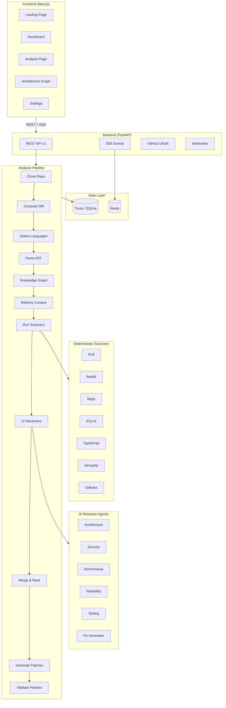

<div align="center">

# 🏥 RepoMedic

### Diagnose Code. Repair Faster. Ship Confidently.

Repository-aware AI code review that detects architectural, security, performance,
and reliability issues — and validates every proposed fix before it reaches your branch.

[](LICENSE)
[](https://python.org)
[](https://nextjs.org)
[](https://fastapi.tiangolo.com)

</div>

---

## Problem

Existing code-review tools are either superficial linters that miss cross-file bugs, or black-box LLM wrappers that hallucinate fixes and never test them. Engineering teams need a review platform that **understands repository context**, combines **deterministic analysis** with **AI reasoning**, and **validates every fix** before suggesting it.

## Solution

RepoMedic connects to your GitHub repositories, analyses pull requests with a multi-stage pipeline, and produces findings backed by both static analysis and contextual AI. Every suggested patch is parsed, linted, type-checked, security-scanned, and tested before a human is asked to approve it.

### What makes it different from an LLM wrapper

| Capability | Generic AI tool | RepoMedic |
|---|---|---|
| Understands cross-file impact | ❌ | ✅ Knowledge graph + blast radius |
| Deterministic scanners first | ❌ | ✅ Ruff, Bandit, Mypy, ESLint, Semgrep, Gitleaks |
| AST-level analysis | ❌ | ✅ Tree-sitter + language-specific rules |
| Validates fixes before showing them | ❌ | ✅ Parse → lint → typecheck → test → security scan |
| Tracks token cost | ❌ | ✅ Per-analysis budget caps |
| Prompt-injection protection | ❌ | ✅ AI firewall on all repository content |

---

## Architecture



---

## Features

### 🔍 Multi-Layer Analysis
- **Deterministic scanners**: Ruff, Bandit, Mypy, ESLint, TypeScript, Semgrep, Gitleaks, OSV
- **AST-based rules**: Tree-sitter parsing for Python, JavaScript, TypeScript
- **AI reviewers**: Architecture, Security, Performance, Reliability, Testing specialists
- **Knowledge graph**: Cross-file impact analysis, circular import detection, blast radius

### 🛡️ Security-First
- Prompt-injection firewall on all repository content
- Secret redaction before LLM transmission
- Encrypted GitHub tokens at rest (Fernet)
- Isolated code execution (Docker sandbox mode)
- Webhook signature validation
- CSRF/CORS protection

### 🔧 Safe Auto-Fix
- AST-aware patch generation (not blind text replacement)
- 6-step validation: parse → lint → typecheck → test → security scan → semantic similarity
- Explainable confidence scores with breakdown
- Human approval required by default
- Creates fix PRs on new branches (never pushes to default)

### 📊 Analytics & Visibility
- Findings by severity, category, and source
- Fix acceptance rate tracking
- Review duration trends
- Most risky modules identification
- Full audit trail

---

## Technology Stack

### Frontend
| Technology | Purpose |
|---|---|
| Next.js 14 (App Router) | Framework |
| TypeScript | Type safety |
| Tailwind CSS | Styling |
| shadcn/ui | Component library |
| TanStack Query | Server state management |
| Monaco Editor | Code diff viewer |
| React Flow | Architecture graph |
| Recharts | Analytics charts |
| Zod | Schema validation |

### Backend
| Technology | Purpose |
|---|---|
| FastAPI | API framework |
| Python 3.11+ | Language |
| SQLModel / SQLAlchemy | ORM |
| Turso / libSQL / SQLite | Database |
| Alembic | Migrations |
| Redis | Queue & pub/sub |
| Dramatiq | Background workers |
| Tree-sitter | AST parsing |
| HTTPX | HTTP client |
| structlog | Structured logging |

### AI & Analysis
| Technology | Purpose |
|---|---|
| Google Gemini | Primary LLM |
| Groq | Fast inference |
| OpenAI-compatible APIs | Local models (Ollama, vLLM, LM Studio) |
| Heuristic engine | Offline fallback |
| Ruff, Bandit, Mypy | Python analysis |
| ESLint, tsc | JS/TS analysis |
| Semgrep, Gitleaks | Security scanning |

---

## Project Structure

```
RepoMedic/
├── frontend/                    # Next.js application
│   ├── app/                     # App Router pages
│   ├── components/              # React components
│   ├── hooks/                   # Custom React hooks
│   ├── lib/                     # Utilities & API client
│   ├── types/                   # TypeScript types
│   └── public/                  # Static assets
│
├── backend/                     # FastAPI application
│   ├── app/
│   │   ├── api/v1/              # REST endpoints
│   │   ├── core/                # Config, security, logging
│   │   ├── db/                  # Database session
│   │   ├── models/              # SQLModel entities
│   │   ├── schemas/             # Pydantic schemas
│   │   ├── services/            # Business logic
│   │   ├── analyzers/           # AST analyzers
│   │   ├── scanners/            # External tool integrations
│   │   ├── agents/              # AI reviewer agents
│   │   ├── llm/                 # LLM provider abstraction
│   │   ├── graph/               # Knowledge graph
│   │   ├── retrieval/           # Context retrieval
│   │   ├── patching/            # Patch generation
│   │   ├── validation/          # Fix validation pipeline
│   │   ├── security/            # Firewall & secret redaction
│   │   ├── workers/             # Background tasks
│   │   └── main.py              # Application entry point
│   ├── alembic/                 # Database migrations
│   ├── fixtures/                # Demo data
│   └── tests/                   # Backend tests
│
├── docker-compose.yml
├── README.md
├── .gitignore
└── LICENSE
```

---

## Local Setup

### Prerequisites
- **Node.js** 18+ and npm
- **Python** 3.11+
- **Redis** (optional — in-process fallback for dev)
- **Git**

### Backend

```bash
cd backend
python -m venv .venv

# Windows
.venv\Scripts\activate
# macOS/Linux
source .venv/bin/activate

pip install -r requirements.txt
cp .env.example .env
# Edit .env as needed (demo mode works with zero configuration)

uvicorn app.main:app --reload
```

Backend runs at `http://localhost:8000`. API docs at `http://localhost:8000/docs`.

### Frontend

```bash
cd frontend
npm install
cp .env.local.example .env.local

npm run dev
```

Frontend runs at `http://localhost:3000`.

### Docker (full stack)

```bash
cp backend/.env.example backend/.env
docker compose up --build
```

---

## Environment Variables

### Frontend (`frontend/.env.local`)
```env
NEXT_PUBLIC_API_URL=http://localhost:8000/api/v1
```

### Backend (`backend/.env`)
See [backend/.env.example](backend/.env.example) for the complete list. Key variables:

| Variable | Purpose |
|---|---|
| `DATABASE_URL` | Turso URL (empty = local SQLite) |
| `JWT_SECRET` | Session signing key |
| `GITHUB_CLIENT_ID` | GitHub OAuth app |
| `GITHUB_CLIENT_SECRET` | GitHub OAuth secret |
| `GEMINI_API_KEY` | Google Gemini API key |
| `GROQ_API_KEY` | Groq API key |
| `REDIS_URL` | Redis connection |
| `DEMO_MODE` | Enable seeded demo data |
| `DEFAULT_LLM_PROVIDER` | `gemini`, `groq`, `local`, `heuristic` |

---

## Demo Mode

Set `DEMO_MODE=true` in `backend/.env` (default). The application seeds:

- **Demo repository**: `ecommerce-api-demo`
- **Demo PR**: "Add discount and checkout endpoints"
- **7 seeded findings**: SQL injection (critical), authorization bypass (high), hardcoded secret (high), N+1 query (medium), blocking async call (medium), duplicate validation (low), missing tests (medium)
- **3 validated fix proposals** with full confidence breakdowns

The dashboard is fully functional without any GitHub account.

---

## API Endpoints

| Method | Endpoint | Description |
|---|---|---|
| `POST` | `/api/v1/auth/github` | Start GitHub OAuth flow |
| `GET` | `/api/v1/auth/github/callback` | OAuth callback |
| `POST` | `/api/v1/auth/demo` | Demo login |
| `GET` | `/api/v1/auth/session` | Current session |
| `GET` | `/api/v1/repositories` | List repositories |
| `GET` | `/api/v1/repositories/{id}` | Repository detail |
| `GET` | `/api/v1/repositories/{id}/pull-requests` | List PRs |
| `GET` | `/api/v1/pull-requests/{id}` | PR detail |
| `POST` | `/api/v1/pull-requests/{id}/analyze` | Trigger analysis |
| `GET` | `/api/v1/analyses/{id}` | Analysis detail |
| `GET` | `/api/v1/analyses/{id}/findings` | Findings with filters |
| `GET` | `/api/v1/analyses/{id}/events` | SSE progress stream |
| `POST` | `/api/v1/findings/{id}/generate-fix` | Generate fix for finding |
| `POST` | `/api/v1/patches/{id}/validate` | Validate a patch |
| `POST` | `/api/v1/patches/{id}/approve` | Approve a patch |
| `POST` | `/api/v1/patches/{id}/reject` | Reject a patch |
| `POST` | `/api/v1/analyses/{id}/publish-review` | Post review to GitHub |
| `POST` | `/api/v1/analyses/{id}/create-fix-pr` | Create fix PR on GitHub |
| `GET` | `/api/v1/repositories/{id}/graph` | Repository graph data |
| `GET` | `/api/v1/repositories/{id}/analytics` | Repository analytics |
| `PUT` | `/api/v1/repositories/{id}/settings` | Update settings |
| `POST` | `/api/v1/webhooks/github` | GitHub webhook receiver |

---

## Testing

### Backend
```bash
cd backend
pytest
pytest --cov=app --cov-report=html
```

### Frontend
```bash
cd frontend
npm test
npm run lint
npm run build  # TypeScript check
```

---

## Deployment

### Frontend → Vercel
```bash
cd frontend
npx vercel
```

### Backend → Railway / Render / Fly.io
Use the provided `backend/Dockerfile`:
```bash
cd backend
docker build -t repomedic-api .
```

### Database → Turso
```bash
turso db create repomedic
turso db tokens create repomedic
# Set DATABASE_URL and DATABASE_AUTH_TOKEN in backend/.env
```

---

## Security Model

- Repository code is treated as **untrusted input**
- AI firewall detects prompt-injection attempts in source code, comments, and README files
- Secrets are **redacted** before transmission to any LLM provider
- GitHub tokens are **encrypted at rest** using Fernet symmetric encryption
- Code execution (scanners/tests) runs in **Docker sandbox containers** in production
- OAuth state is signed and time-limited
- All API calls require authentication via HTTP-only session cookies
- Complete **audit logging** of every action

---

## Known Limitations

- Java, Go, C++, Rust analyzers are not yet implemented (architecture supports adding them)
- Vector embeddings use local Jaccard similarity (no external vector store)
- Test execution requires Docker sandbox mode for safety
- Webhook events require a public-facing URL (use ngrok for local development)
- Cost tracking is estimated, not based on actual billing API responses

---

## Roadmap

- [ ] Java and Go language analyzers
- [ ] Team collaboration and multi-user workspaces
- [ ] GitHub check-run integration
- [ ] Custom rule editor with visual builder
- [ ] Slack/Discord notifications
- [ ] VS Code extension
- [ ] Self-hosted vector store (Qdrant/Milvus)
- [ ] Repository-level learning (learns project conventions over time)

---

## License

[MIT](LICENSE) © 2026 RepoMedic
