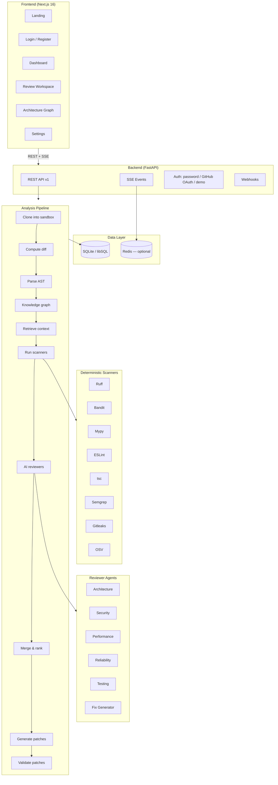

<div align="center">

---

## Table of contents

- [Why RepoMedic was built](#why-repomedic-was-built)
- [What you actually get](#what-you-actually-get)
- [How it works](#how-it-works)
- [Quick start](#quick-start)
- [How to use it](#how-to-use-it)
- [Configuration](#configuration)
- [Architecture](#architecture)
- [Project structure](#project-structure)
- [API reference](#api-reference)
- [Testing](#testing)
- [Deployment](#deployment)
- [Security model](#security-model)
- [Known limitations](#known-limitations)
- [Roadmap](#roadmap)

---

## Why RepoMedic was built

Code review is the last checkpoint before a defect becomes production traffic, and it is
the checkpoint under the most time pressure. The tools meant to help fall into two camps,
and both leave the same gap.

**Linters see one file at a time.** Ruff, ESLint and Mypy are fast, deterministic and
trustworthy — but they are structurally incapable of noticing that the function you just
changed is called by a payment handler that never validates its input, or that removing a
parameter breaks three call sites in another package. The defects that cause real outages
are usually *relational*: they live in the space between files, not inside one.

**LLM review tools see the diff and nothing else.** They can reason about intent, which
linters cannot, but a model handed a diff with no repository context produces confident
guesses. It invents functions that do not exist, suggests patches that do not compile, and
reports issues that a linter already caught, at a different severity, with no explanation
of which to believe. Worst of all, the suggested fix arrives **untested** — so the reviewer
still has to verify it manually, which is the work the tool was supposed to remove.

RepoMedic was built on the premise that these are not competing approaches but ordered
ones:

> Run everything deterministic first. Use the model only where judgement is genuinely
> required. Then prove the result before showing it to a human.

Concretely, that means deterministic scanners run *before* any model is called and carry
most of the weight. A knowledge graph resolves what each change can actually reach, so the
model receives the changed code plus its real dependents — never the whole repository, and
never just the diff. And every patch the system proposes is applied inside a sandbox and
put through parse, lint, type-check, security-scan and test stages, with the results
attached to the patch. **If the fix fails validation, you see that it failed.**

---

## What you actually get

| Benefit                                            | What it means in practice                                                                                                                                                |
| -------------------------------------------------- | ------------------------------------------------------------------------------------------------------------------------------------------------------------------------ |
| **Cross-file defects get caught**            | A knowledge graph of symbols, imports and calls resolves blast radius, so a change is reviewed against the code that depends on it — not in isolation.                  |
| **Findings you can verify**                  | Every finding names a file and line, explains the failure it causes, cites the tools that corroborate it, and carries a confidence score. Nothing is "the AI thinks so." |
| **Fixes that are already tested**            | Each patch is applied in a sandbox and re-parsed, linted, type-checked, security-scanned and tested against the baseline. You review a*proven* diff, not a suggestion. |
| **Far fewer false positives**                | Findings from multiple sources are deduplicated and merged into one ranked list with corroboration, instead of three tools shouting the same thing at three severities.  |
| **It cannot quietly break your repo**        | Auto-apply is off by default. Approved fixes only ever open a new branch — never a commit to your default branch.                                                       |
| **Your secrets do not leave**                | Secrets are detected and redacted before any content reaches a model, and each analysis records exactly what was transmitted.                                            |
| **Malicious repos cannot hijack the review** | Prompt-injection attempts hidden in comments, READMEs, base64 or zero-width characters are neutralised and reported as findings.                                         |
| **It runs with zero API keys**               | A built-in heuristic engine is the default provider, so the whole product works offline. Add a Gemini or Groq key only when you want model-backed reasoning.             |
| **Predictable cost**                         | Per-analysis budget caps, token accounting and context limits are enforced before a request is made.                                                                     |

---

## How it works

The analysis pipeline runs in a fixed order. Each stage narrows what the next one has to
consider.

| #            | Stage              | What happens                                                                                                                                                                                                                                                         |
| ------------ | ------------------ | -------------------------------------------------------------------------------------------------------------------------------------------------------------------------------------------------------------------------------------------------------------------- |
| **01** | **Isolate**  | The pull request is cloned into a disposable, size-capped workspace with no network access. Repository code never executes on the host and is deleted after the retention window.                                                                                    |
| **02** | **Parse**    | Python is parsed with the stdlib`ast`; JavaScript and TypeScript with tree-sitter. Symbols, imports and calls become a knowledge graph.                                                                                                                            |
| **03** | **Scan**     | Ruff, Bandit, Mypy, ESLint, tsc, Semgrep, Gitleaks and OSV run — before any model. Output is normalised into one schema and deduplicated.                                                                                                                           |
| **04** | **Retrieve** | Only the changed hunks plus graph-adjacent code are selected as context. The model never receives the whole repository.                                                                                                                                              |
| **05** | **Review**   | Five specialist agents (architecture, security, performance, reliability, testing) assess what deterministic tools cannot judge.                                                                                                                                     |
| **06** | **Rank**     | Findings are merged, corroborated across sources, scored and ordered by severity and confidence.                                                                                                                                                                     |
| **07** | **Patch**    | Fixes are generated AST-aware — modifying the syntax tree, not blind text replacement.                                                                                                                                                                              |
| **08** | **Validate** | Each patch is applied in the sandbox and run through six steps — parse, lint, type-check, security scan, tests against the baseline, and semantic similarity. Each step short-circuits the ones that cannot follow, and a skipped step is recorded with its reason. |

Results stream to the browser over Server-Sent Events, so you watch the pipeline progress
live rather than staring at a spinner.

---

## Quick start

Runs with **no API keys, no Docker and no Redis**. The defaults are chosen so a fresh clone
works immediately.

### Prerequisites

- **Node.js** 18+ and npm
- **Python** 3.10+
- **Git**
- *(Optional)* Redis — an in-process fallback is used when absent
- *(Optional)* Docker — for sandboxed test execution

### 1. Backend

```bash
cd backend
python -m venv .venv

# Windows
.venv\Scripts\activate
# macOS / Linux
source .venv/bin/activate

pip install -r requirements.txt
cp .env.example .env

uvicorn app.main:app --reload
```

API on `http://localhost:8000` · interactive docs on `http://localhost:8000/docs`.

> **Generating secrets.** `JWT_SECRET` can be any random string, but `ENCRYPTION_KEY` **must
> be a Fernet key** — a hex string will fail at the first token write:
>
> ```bash
> python -c "from cryptography.fernet import Fernet; print(Fernet.generate_key().decode())"
> ```
>
> Leave both blank in development and deterministic dev-only values are derived
> automatically.

### 2. Frontend

```bash
cd frontend
npm install
cp .env.local.example .env.local

npm run dev
```

App on `http://localhost:3000`.

### 3. Seed the demo workspace

`DEMO_MODE=true` (the default) seeds on first boot. To rebuild it by hand:

```bash
cd backend
python scripts/seed_demo.py           # seed if not present
python scripts/seed_demo.py --force   # rebuild the analysis
python scripts/seed_demo.py --reset   # delete the demo repository
```

This runs the **real analyzers** over `backend/fixtures/ecommerce-api-demo` — a
deliberately vulnerable storefront API — rather than inserting canned rows. You get one
repository, one pull request, **15 findings** (2 critical, 8 high, 5 medium) and **4
validated patches**.

### Docker (full stack)

```bash
cp backend/.env.example backend/.env
docker compose up --build
```

---

## How to use it

### Step 1 — Sign in

Open `http://localhost:3000`. There are three ways in:

| Option                                      | Use it when                                                                                                                         |
| ------------------------------------------- | ----------------------------------------------------------------------------------------------------------------------------------- |
| **Explore the demo workspace**        | You want to see the product immediately. No account, no GitHub. Seeded from a local fixture repository; GitHub writes are disabled. |
| **Create an account** (`/register`) | Email and password. Requires 10+ characters with a letter and a number.                                                             |
| **Continue with GitHub**              | You want to review your own repositories. Requires`GITHUB_CLIENT_ID` / `GITHUB_CLIENT_SECRET`.                                  |

### Step 2 — Connect repositories

Go to **Settings → GitHub Connection**, or the **Repositories** page, and choose:

- **Connect GitHub** — starts the OAuth flow if your account is not linked yet.
- **Sync repositories** — imports everything the installation can see.

The demo account holds no GitHub credential and will tell you so rather than failing
silently.

### Step 3 — Open a pull request

**Repositories → \<your repo\> → Pull Requests**, then open one. You will see its branches,
diff size and full analysis history.

### Step 4 — Run an analysis

Press **Run AI Analysis**. You are taken to the review workspace, where progress streams
live: which scanner is running, which reviewer is active, and findings appearing as they
are confirmed.

### Step 5 — Review findings

The workspace has three panels:

- **Left** — changed files, badged with the highest severity found in each.
- **Centre** — a Monaco diff viewer with the offending line highlighted.
- **Right** — findings, each with an explanation, the concrete risk, the corroborating
  tools and a confidence score. Filter by severity or search by file and title.

### Step 6 — Approve or reject a fix

Where a patch was generated, the finding card shows the proposed diff, its validation
results (parse, lint, type-check, security, tests) and a confidence breakdown.

- **Approve Fix** — marks the patch as accepted.
- **Reject** — records the rejection with its reason.

Nothing reaches your repository from this step alone.

### Step 7 — Publish back to GitHub

Two explicit actions, both gated behind human approval:

- **Publish Review Comment** — posts findings as a GitHub review.
- **Create Fix Pull Request** — opens a **new branch** with the approved patches. It never
  commits to your default branch.

### Step 8 — Track the posture

- **Dashboard** — repositories, total findings, severity breakdown, fix acceptance rate,
  average review duration.
- **Architecture** — the knowledge graph, with a per-node blast radius: what it imports,
  what depends on it, and which test suites cover it. A node with no covering tests is
  reported as uncovered.
- **Analytics** — findings by severity across every analysed pull request.

---

## Configuration

### Frontend — `frontend/.env.local`

```env
NEXT_PUBLIC_API_URL=http://localhost:8000/api/v1
```

### Backend — `backend/.env`

See [backend/.env.example](backend/.env.example) for all 45 variables. The ones that matter
most:

| Variable                                        | Default              | Purpose                                                                                                               |
| ----------------------------------------------- | -------------------- | --------------------------------------------------------------------------------------------------------------------- |
| `DATABASE_URL`                                | *(empty)*          | Empty uses local SQLite at`backend/data/repomedic.db`. `libsql://<db>.turso.io` uses Turso — see the note below. |
| `DATABASE_AUTH_TOKEN`                         | *(empty)*          | Turso auth token (`turso db tokens create <db>`).                                                                   |
| `JWT_SECRET`                                  | *(derived in dev)* | Session signing key.**Required outside development.**                                                           |
| `ENCRYPTION_KEY`                              | *(derived in dev)* | **Must be a Fernet key**, not `openssl rand -hex 32`. Encrypts GitHub tokens at rest.                         |
| `DEMO_MODE`                                   | `true`             | Seeds the demo workspace on boot.                                                                                     |
| `DEFAULT_LLM_PROVIDER`                        | `heuristic`        | `gemini`, `groq`, `local` or `heuristic` (offline, no key).                                                   |
| `GEMINI_API_KEY` / `GROQ_API_KEY`           | *(empty)*          | Only needed for model-backed reasoning.                                                                               |
| `LOCAL_LLM_BASE_URL`                          | *(empty)*          | Any OpenAI-shaped server — Ollama, vLLM, LM Studio.                                                                  |
| `GITHUB_CLIENT_ID` / `GITHUB_CLIENT_SECRET` | *(empty)*          | Required for GitHub sign-in and repository import.                                                                    |
| `GITHUB_WEBHOOK_SECRET`                       | *(empty)*          | Validates webhook signatures.                                                                                         |
| `COOKIE_SAMESITE`                             | `lax`              | Use `none` when the app and API are on different sites — see [DEPLOYMENT.md](DEPLOYMENT.md).                          |
| `SANDBOX_MODE`                                | `subprocess`       | `docker`, `subprocess` or `disabled`. Use `docker` in production.                                             |
| `MAX_ANALYSIS_COST_USD`                       | —                   | Hard budget cap per analysis.                                                                                         |
| `REDIS_URL`                                   | *(empty)*          | Falls back to an in-process queue when absent.                                                                        |

> **Note on Turso.** Set `DATABASE_URL=libsql://<your-db>.turso.io` plus `DATABASE_AUTH_TOKEN`
> and it works — the URL is routed to a custom dialect in
> [`backend/app/db/libsql_dialect.py`](backend/app/db/libsql_dialect.py) that reaches Turso
> over the **HTTP** transport.
>
> This dialect exists because the stock `sqlite+libsql` driver
> (`sqlalchemy-libsql` 0.1.0 / `libsql-client` 0.3.1) speaks **only** WebSocket, and current
> Turso databases reject the WebSocket handshake with `400`. Upgrading is not an option
> either: `sqlalchemy-libsql` 0.2.0 depends on `libsql-experimental`, which ships no wheel for
> CPython 3.10 on Windows. The `libsql` package does ship wheels and speaks HTTP, so the
> dialect adapts it to SQLAlchemy. **Do not switch `DATABASE_URL` back to `sqlite+libsql://`.**

### Database schema

There are no Alembic revisions yet. Tables are created by `SQLModel.metadata.create_all()`
on boot. Because `create_all` never alters an existing table, columns added later are
applied by the additive step in [`backend/app/db/session.py`](backend/app/db/session.py) —
add new columns to `_ADDITIVE_COLUMNS` there.

---

## Architecture



### Technology

**Frontend** — Next.js 16 (App Router), React 19, TypeScript 5, Tailwind CSS v4, TanStack
Query, Monaco Editor, React Flow (`@xyflow/react`), Recharts, Zod. UI primitives are
hand-built on `class-variance-authority`; there is no component-library dependency.

**Backend** — FastAPI 0.115, Python 3.10+, SQLModel / SQLAlchemy, SQLite / libSQL,
Dramatiq + Redis (optional), tree-sitter, HTTPX, structlog, `cryptography` (Fernet).

**Analysis** — Ruff, Bandit, Mypy, Radon, ESLint, tsc, npm-audit, Semgrep, Gitleaks, OSV,
Trivy · Google Gemini, Groq, any OpenAI-compatible server, or the offline heuristic engine.

---

## Project structure

```
RepoMedic/
├── frontend/                    # Next.js application
│   ├── app/
│   │   ├── (auth)/              # login, register
│   │   ├── dashboard/           # workspace overview
│   │   ├── repositories/        # list + detail
│   │   ├── pull-requests/       # PR detail + analysis history
│   │   ├── analysis/            # 3-panel review workspace
│   │   ├── architecture/        # knowledge graph + blast radius
│   │   ├── analytics/           # severity breakdown
│   │   └── settings/            # GitHub connection, LLM config
│   ├── components/
│   │   ├── auth/                # RequireAuth, AuthShell
│   │   ├── code-review/         # DiffViewer, FindingCard, FileTree, FilterBar
│   │   ├── layout/              # Sidebar, Header
│   │   ├── repositories/        # ConnectRepositories, RepositorySelect
│   │   └── ui/                  # Button, Card, Badge, Input
│   ├── hooks/                   # useAuth, useRepositories, useAnalysis, …
│   ├── lib/                     # API client, auth, utilities
│   └── types/                   # TypeScript mirrors of backend schemas
│
├── backend/
│   ├── app/
│   │   ├── api/v1/              # REST endpoints
│   │   ├── core/                # config, security, logging, rate limiting
│   │   ├── db/                  # engine, session, additive columns
│   │   ├── models/              # SQLModel entities (11 tables)
│   │   ├── schemas/             # Pydantic request/response models
│   │   ├── services/            # analysis pipeline, auth, analytics, demo
│   │   ├── analyzers/           # Python AST + JS/TS tree-sitter rules
│   │   ├── scanners/            # external tool integrations
│   │   ├── agents/              # 5 reviewers + fix generator
│   │   ├── llm/                 # provider abstraction
│   │   ├── graph/               # knowledge graph builder
│   │   ├── retrieval/           # chunking, embedding, context assembly
│   │   ├── patching/            # differ + deterministic templates
│   │   ├── validation/          # 6-step fix validation
│   │   ├── security/            # prompt-injection firewall, redaction
│   │   ├── workers/             # background tasks
│   │   └── main.py
│   ├── scripts/seed_demo.py     # seed / rebuild / reset the demo
│   ├── fixtures/                # deliberately vulnerable demo repository
│   └── tests/                   # pytest suite
│
├── docker-compose.yml
├── README.md
└── LICENSE
```

---

## API reference

Full interactive documentation at `http://localhost:8000/docs`.

### Auth

| Method   | Endpoint                         | Description                                                                    |
| -------- | -------------------------------- | ------------------------------------------------------------------------------ |
| `POST` | `/api/v1/auth/register`        | Create an email + password account                                             |
| `POST` | `/api/v1/auth/login`           | Sign in with email + password                                                  |
| `POST` | `/api/v1/auth/github`          | Start the GitHub OAuth flow                                                    |
| `GET`  | `/api/v1/auth/github/callback` | OAuth callback                                                                 |
| `POST` | `/api/v1/auth/demo`            | Sign in to the seeded demo workspace                                           |
| `GET`  | `/api/v1/auth/session`         | Current session — returns`200` with `authenticated: false` when anonymous |
| `POST` | `/api/v1/auth/logout`          | Clear the session cookie                                                       |

### Repositories & pull requests

| Method   | Endpoint                                          | Description                     |
| -------- | ------------------------------------------------- | ------------------------------- |
| `GET`  | `/api/v1/repositories`                          | List connected repositories     |
| `POST` | `/api/v1/repositories/sync`                     | Import repositories from GitHub |
| `GET`  | `/api/v1/repositories/{id}`                     | Repository detail               |
| `GET`  | `/api/v1/repositories/{id}/pull-requests`       | List pull requests              |
| `POST` | `/api/v1/repositories/{id}/pull-requests/sync`  | Re-sync pull requests           |
| `GET`  | `/api/v1/repositories/{id}/settings` · `PUT` | Read / update review settings   |
| `GET`  | `/api/v1/pull-requests/{id}`                    | Pull-request detail             |
| `GET`  | `/api/v1/pull-requests/{id}/analyses`           | Analysis history                |
| `POST` | `/api/v1/pull-requests/{id}/analyze`            | Queue an analysis               |

### Analyses, findings & patches

| Method    | Endpoint                                                         | Description                   |
| --------- | ---------------------------------------------------------------- | ----------------------------- |
| `GET`   | `/api/v1/analyses/{id}`                                        | Analysis detail               |
| `GET`   | `/api/v1/analyses/{id}/events`                                 | SSE progress stream           |
| `GET`   | `/api/v1/analyses/{id}/findings`                               | Findings, with filters        |
| `GET`   | `/api/v1/analyses/{id}/patches`                                | Patches for an analysis       |
| `POST`  | `/api/v1/analyses/{id}/cancel`                                 | Cancel a running analysis     |
| `POST`  | `/api/v1/analyses/{id}/publish-review`                         | Post the review to GitHub     |
| `POST`  | `/api/v1/analyses/{id}/create-fix-pr`                          | Open a fix PR on a new branch |
| `GET`   | `/api/v1/findings/{id}`                                        | Finding detail                |
| `PATCH` | `/api/v1/findings/{id}/status`                                 | Update finding status         |
| `POST`  | `/api/v1/findings/{id}/generate-fix`                           | Generate a patch              |
| `POST`  | `/api/v1/patches/{id}/validate` · `/approve` · `/reject` | Patch lifecycle               |

### Graph, analytics & system

| Method   | Endpoint                                   | Description                                       |
| -------- | ------------------------------------------ | ------------------------------------------------- |
| `GET`  | `/api/v1/repositories/{id}/graph`        | Knowledge graph                                   |
| `GET`  | `/api/v1/repositories/{id}/graph/impact` | Impact paths for findings                         |
| `GET`  | `/api/v1/repositories/{id}/analytics`    | Per-repository analytics                          |
| `GET`  | `/api/v1/dashboard`                      | Workspace-wide summary                            |
| `GET`  | `/api/v1/capabilities`                   | Which scanners and providers are usable right now |
| `GET`  | `/api/v1/health`                         | Health check                                      |
| `POST` | `/api/v1/webhooks/github`                | GitHub webhook receiver                           |

---

## Testing

### Backend

```bash
cd backend
pytest                                  # 54 tests
pytest --cov=app --cov-report=html      # with coverage
ruff check app tests scripts            # lint
```

Tests bind to a throwaway SQLite database, so your development data is never touched.

### Frontend

```bash
cd frontend
npm run lint        # ESLint
npx tsc --noEmit    # type check
npm run build       # production build
```

> There is no `npm test` script — the frontend has no unit-test suite yet.

---

## Deployment

**📘 See [DEPLOYMENT.md](DEPLOYMENT.md)** for the full step-by-step guide — Vercel (frontend),
Render (backend) and Turso (database), with an environment-variable reference, a
troubleshooting table and a production checklist.

The short version:

```bash
# Frontend → Vercel  (root directory: frontend)
cd frontend && npx vercel --prod

# Backend → Render / Fly.io  (Docker, root directory: backend)
cd backend && docker build -t repomedic-api .
```

For production set `APP_ENV=production`, a real `JWT_SECRET`, a genuine Fernet
`ENCRYPTION_KEY`, and `COOKIE_SECURE=true`.

> **If the app and API are on different domains** — the usual Vercel + Render split — you
> must also set `COOKIE_SAMESITE=none`. A `SameSite=Lax` cookie is never sent cross-site, and
> the SSE progress stream authenticates by cookie because `EventSource` cannot send a bearer
> token. Without it, sign-in works but live analysis progress silently stalls.

---

## Security model

Repository code is treated as **untrusted input** throughout.

- **Sandboxed execution** — scanners and tests run with no network access and CPU, memory
  and process limits. Repository code never executes on the host in `docker` mode.
- **Prompt-injection firewall** — instructions hidden in comments, READMEs, base64 or
  zero-width characters are neutralised and surfaced as findings.
- **Secret redaction** — content is scanned and redacted before reaching any model, and
  each analysis records what was transmitted.
- **Encrypted tokens at rest** — GitHub credentials are stored as Fernet ciphertext.
- **Password storage** — PBKDF2-HMAC-SHA256, 600,000 iterations, per-password salt, with
  the iteration count stored per hash so the cost can be raised without invalidating
  existing credentials.
- **Authentication timing** — a wrong password and an unknown account take the same time
  and return the same message, so the API never discloses which addresses exist.
- **Signed OAuth state** — time-limited, HMAC-signed, and restricted to same-site redirects.
- **Hardened cookies** — HTTP-only, `SameSite=Lax`, `Secure` in production.
- **Webhook signatures** — constant-time `X-Hub-Signature-256` validation.
- **GitHub write gates** — auto-apply off by default; fixes only ever open a new branch.
- **Full audit trail** — every login, analysis, approval and publish is recorded.

---

## Known limitations

These are real constraints, not future work:

- **Turso needs the bundled custom dialect** (`app/db/libsql_dialect.py`), because the stock
  `sqlite+libsql` driver cannot connect. See the configuration note above.
- **No Alembic revisions.** Schema comes from `create_all` plus an additive-column step.
- **Language coverage** is Python, JavaScript and TypeScript. Java, Go, Rust and C++ plug
  into the same analyzer interface but are not implemented.
- **Retrieval uses local lexical similarity**, not a vector database.
- **Test execution needs `SANDBOX_MODE=docker`** to be safe; `subprocess` mode runs tools on
  the host and should stay on trusted code.
- **Webhooks need a public URL** — use ngrok locally.
- **Cost figures are estimates** derived from token counts, not billing-API responses.
- **No password reset or email verification** — there is no mail transport configured, so
  an address is trusted at face value.
- **The frontend has no unit tests.** Type checking, linting and the production build are
  the current safety net.

---

## Roadmap

- [ ] Java and Go analyzers
- [ ] Alembic migration history
- [ ] Password reset and email verification
- [ ] Team workspaces and multi-user collaboration
- [ ] GitHub check-run integration
- [ ] Visual custom-rule editor
- [ ] Slack / Discord notifications
- [ ] VS Code extension
- [ ] Self-hosted vector store (Qdrant / Milvus)
- [ ] Repository-level learning of project conventions

---

## License

[MIT](LICENSE) © 2026 RepoMedic
